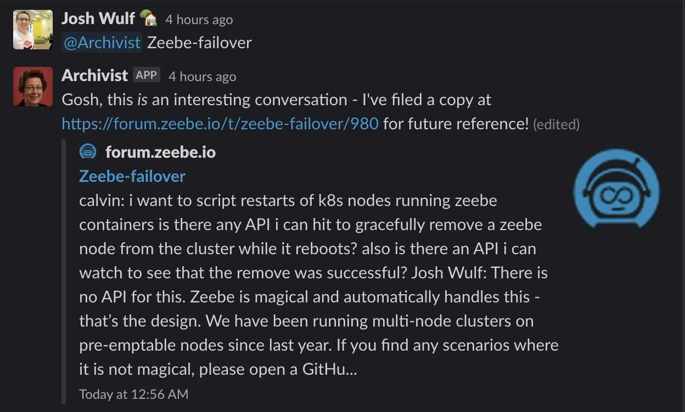
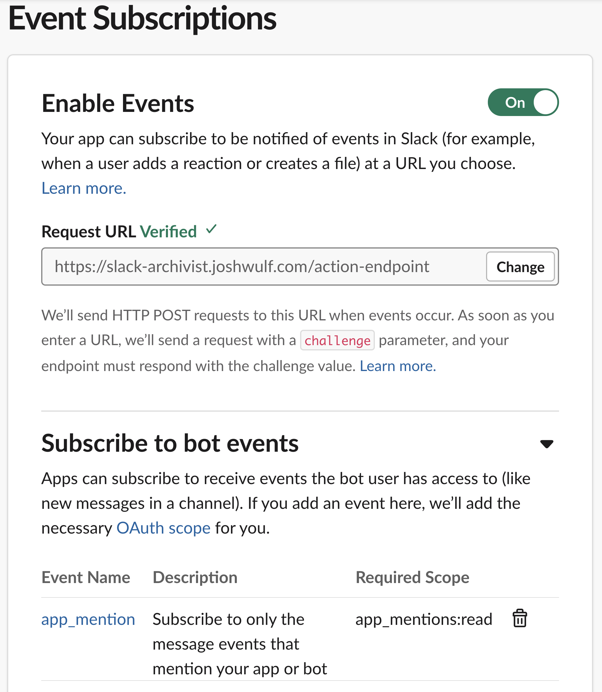
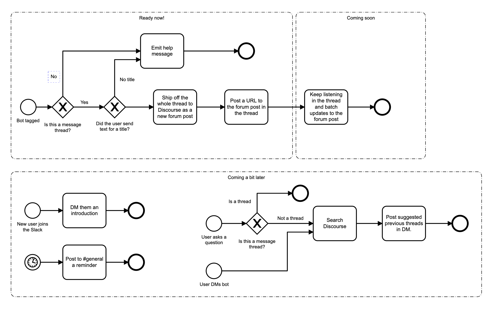

# Slack Archivist

Your friendly Slack-to-Discourse archivist.


This is a Slack bot that can ship threads off to a Discourse instance as forum posts on request.

It was inspired by Dgraph's [Wisemonk](https://github.com/dgraph-io/wisemonk), and built for the [Zeebe.io](https://zeebe.io) community Slack.

One of the issues with hosting a community on Slack is the loss of history. Valuable discussions and answers to questions quickly scroll over the 10,000 message horizon. A number of technical communities have moved to Discord to deal with this.

We looked at doing that, but then saw an opportunity to build a searchable knowledge base on our [forum](https://forum.zeebe.io) by sending valuable threads there as posts. There they can be curated by editors, indexed by Google, and discovered by other members of our community searching for answers.

Dgraph had a similar idea a few years ago, and built Wisemonk in Go. It hasn't been updated for a few years, and I couldn't get it to work - so I coded this up in TypeScript, using Slack's Web API and Events API.

## Using in Slack

In a thread (this is important - your conversations need to be threaded), @ the bot with what you want as the title. The bot will then roll up the thread and turn it into a forum post.

Example:



Here is [the post](https://forum.zeebe.io/t/zeebe-failover/980) generated from this thread.

## Prerequisites

Obviously you will need a Slack where you can add bot users, and a Discourse instance where you can get an API key. You will also need to run the bot with a resolvable DNS address, or at least an external IP, as it needs to listen to Push notifications from Slack's Event API.

Here are the [instructions about creating a bot user on Slack](https://api.slack.com/bot-users). You only need to do steps 1 - 3.

The bot will need the following scopes in its OAuth settings:

* app_mentions:read
* channels:history
* channels:join
* channels:read
* chat:write
* im:history
* im:read
* im:write
* incoming-webhook
* links:read
* links:write
* reactions:write
* users.profile:read
* users:read
* users:write

You will need to set up the Event Subscriptions for the bot, like this:



## Database

The Slack Archivist bot uses a PouchDB to track the threads that it has archived. The database is created locally using the leveldown adapter in the `slack-archivist-db` directory, so you should mount that into the docker container to ensure its persistence across container lifecycles.

You can optionally provide a `COUCHDB_URL` via the environment to sync the database with a remote CouchDB instance. This is recommended to ensure the persistence of data. You can start a CouchDB instance easily in Google Cloud using [Bitnami](https://bitnami.com/stack/couchdb/cloud/google), or use [IBM Cloudant](https://www.ibm.com/cloud/cloudant).

## Running from Docker

Read the `docker-compose.yml` file and set up either the environment variables or a `.env` file. Then run:

```
docker-compose up -d
```

If you want to run this using https, you can do it easily using the [Nginx / LetsEncrypt Docker sidecar](https://github.com/jwulf/letsencrypt-nginx-sidecar).

## Installation from source

To install, clone the repository, then run: 

```
npm i
```

## Configuration

You configure Slack Archivist via environment variables:

```
# Required
DISCOURSE_TOKEN
DISCOURSE_USER
DISCOURSE_CATEGORY
DISCOURSE_URL

SLACK_TOKEN
SLACK_SIGNING_SECRET
SLACK_BOTNAME

# Optional
SLACK_PORT # Default: 3000

COUCHDB_URL # For syncing


```

You can set these through your environment, or put them into a `.env` file.

Rename `env` to `.env`, and fill in your Slack bot and Discord details. 

The message templates for the Slack Archivist messages can be found in the `messages` directory.

## Running

You can run the bot using `ts-node`: 

```
npm i -g ts-node
ts-node src/main.ts
```

Or by transpiling to JS:

```
npm run build
npm run start
```

You can also deploy the bot using docker, following the instructions and template in the `deploy` directory.

## Bot Behaviour

The bot behaviour is described in the [Behaviour.bpmn](Behaviour.bpmn) file.



## Livestream 

I livestreamed a lot of the coding:

* [Building a Slack bot - Slack Archivist for the Zeebe Community: Part 1 of 2](https://youtu.be/v5CkZb-xlBc)

* [Building a Slack bot - Slack Archivist for the Zeebe Community: Part 2 of 2](https://youtu.be/n3zDiqRgW0o)

## Resources

* [Slack event JSON Schema](https://github.com/slackapi/slack-api-specs/blob/master/events-api/slack_common_event_wrapper_schema.json)